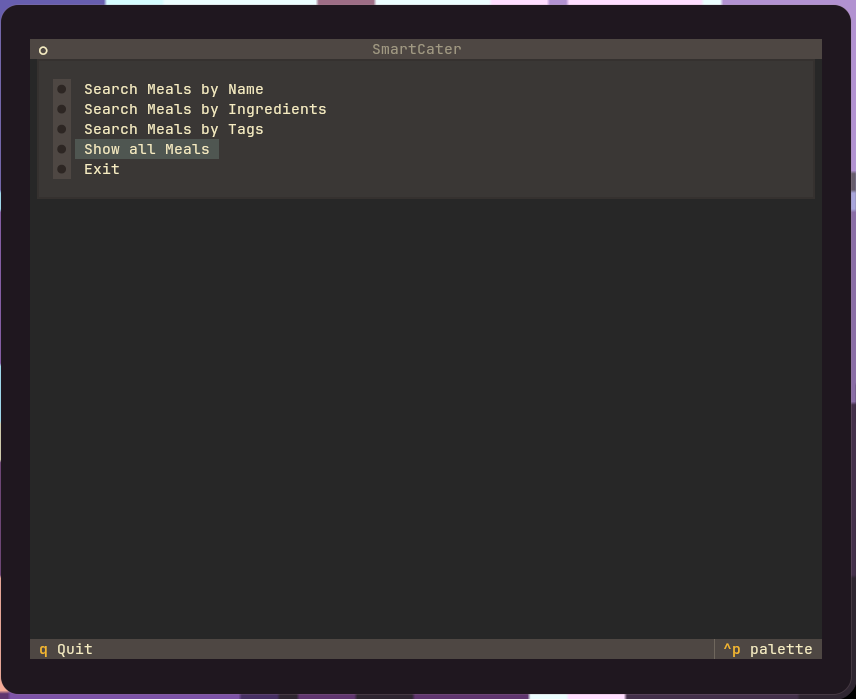
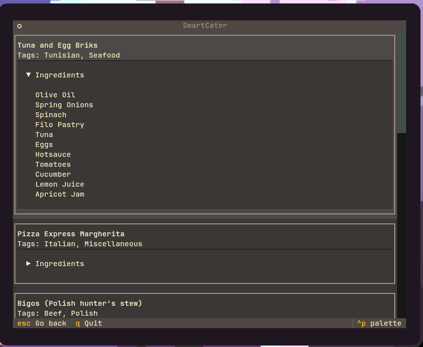
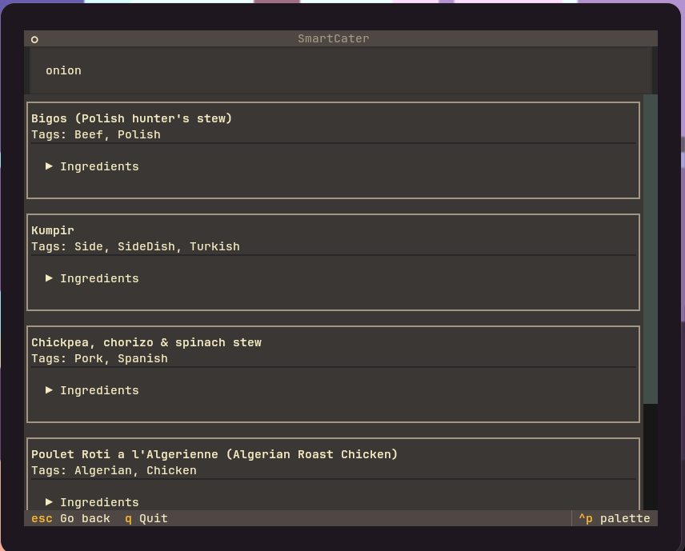
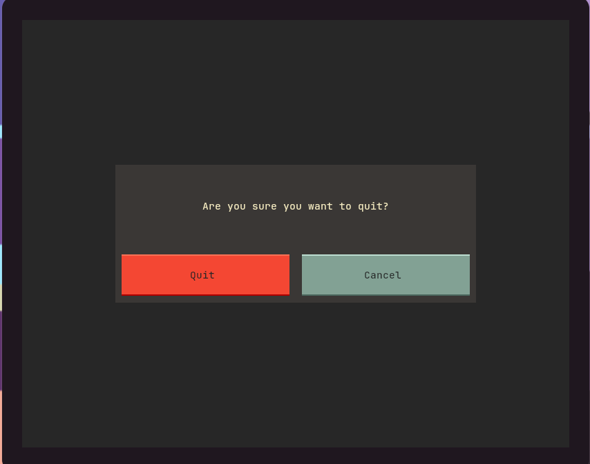

# SmartCater Prototype
## Installation
```
git clone https://github.com/navy356/ase25-assignment04-navyanewatia.git
cd ase25-assignment04-navyanewatia
```
## Optional (Install for better interface,sample generation)
```
pip install -r requirements.txt
```
## Usage
This will use the console app unless optional requirements are installed, in which case the textual app will be used.
```
python smart_cater.py
```
### To use console app even if optional requirements are installed
```
python smart_cater.py console
```
### To re-generate samples (from themealdb.com)
You can choose to generate any number of samples instead of just 10 
```
cd samples
python meal_gen.py 10
cd ..
```
The new samples will be written to ``samples/samples.json``. The original meal samples will still be in ``samples/meals.json``.

## Menu Navigation
### Main Menu

Simple click to 



<!--stackedit_data:
eyJoaXN0b3J5IjpbLTYyNjg1NjgyNV19
-->