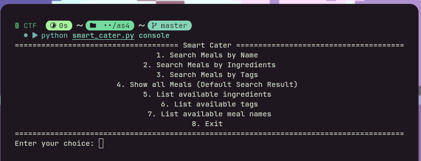
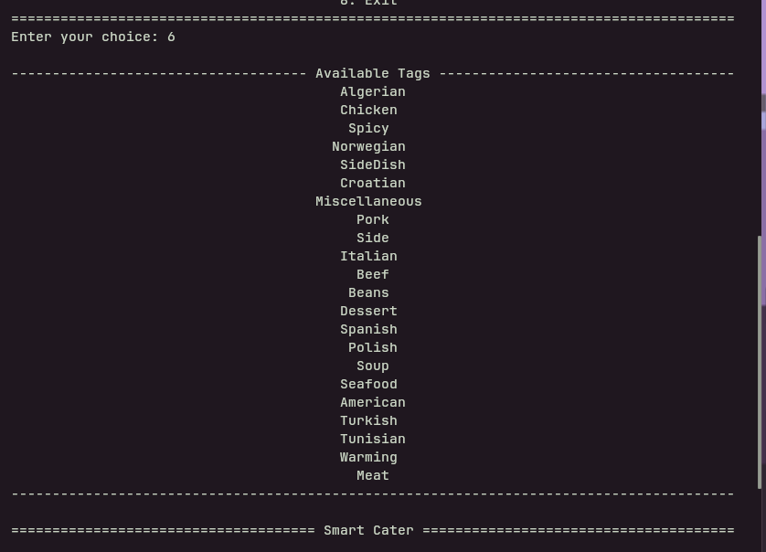
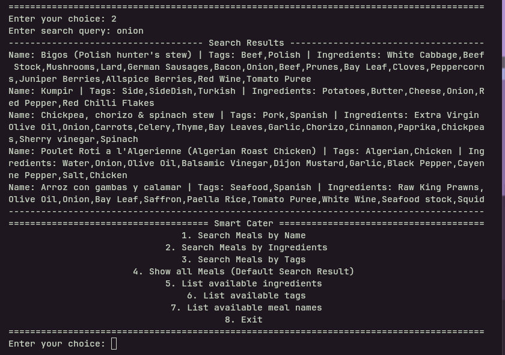
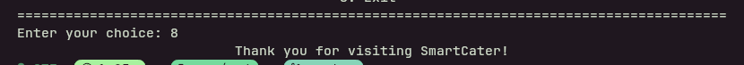

# SmartCater Prototype
## Installation
```
git clone https://github.com/navy356/ase25-assignment04-navyanewatia.git
cd ase25-assignment04-navyanewatia
```
## Optional (Install for better interface,sample generation)
```
pip install -r requirements.txt
```
## Usage
This will use the console app unless optional requirements are installed, in which case the textual app will be used.
```
python smart_cater.py
```
### To use console app even if optional requirements are installed
```
python smart_cater.py console
```
### To re-generate samples (from themealdb.com)
You can choose to generate any number of samples instead of just 10 
```
cd samples
python meal_gen.py 10
cd ..
```
The new samples will be written to ``samples/samples.json``. The original meal samples will still be in ``samples/meals.json``.

## Textual Menu Navigation
In general, all key bindings will be displayed at the bottom of the screen. You can use ``q`` at any point to instantly quit the application.
### Main Menu
Simply click to select an option or use arrow keys and press enter.

### Show all Meals
To return to main menu press ``Escape`` or ``Backspace``

### Search
Click the input dialog, type your search query and press enter to display search results.
To return to main menu press ``Escape`` or ``Backspace``

### Quit
This dialog box only appears when choosing to exit from main menu. If ``q`` is pressed to exit it will not appear. That is the only difference between the two methods to exit.


## Console Menu Navigation
### Main Menu
The app will always come back to the main menu unless exit is selected. To select an option enter the correponding number into the input prompt and press enter.

### Info
The options like ``List available tags`` are added to the console app to easier get existing tags from the sample meals to search for.

### Search
If you choose to search per a given filter, enter you search query into the given prompt and press enter. The search results will be displayed.

### Quit
To exit simply enter the corresponding number from the main menu and press enter.

<!--stackedit_data:
eyJoaXN0b3J5IjpbLTExNTgyMzYyOTEsMTI3ODE0NTc3NF19
-->